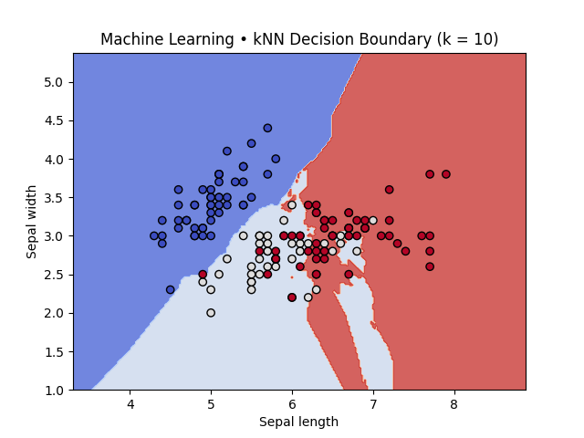

# Machine Learning Project: kNN Classification on Iris Dataset

This project demonstrates **k-Nearest Neighbors (kNN) classification** on the Iris dataset  
using scikit-learn. The model is trained with different values of *k* (1, 3, 5, 10)  
and decision boundaries are plotted to visualize how classification changes.

---

## Student Info
- Name: Zahra Dastfal  
- Student ID: 700777425  

---

## How to Run

1. Install dependencies:
```bash
pip install scikit-learn matplotlib numpy

## Results

### Accuracy Table
| k  | Train Accuracy | Test Accuracy |
|----|----------------|---------------|
| 1  | 1.0000         | 0.8667        |
| 3  | 0.9667         | 0.9333        |
| 5  | 0.9500         | 0.9333        |
| 10 | 0.9333         | 0.9000        |

### Analysis
- **k=1**: Overfits, decision boundaries are very detailed.  
- **k=3 or 5**: Best balance between bias and variance.  
- **k=10**: Too smooth, risk of underfitting.  

### Decision Boundary Plots
- **k=1**  


- **k=3**  


- **k=5**  


- **k=10**  

